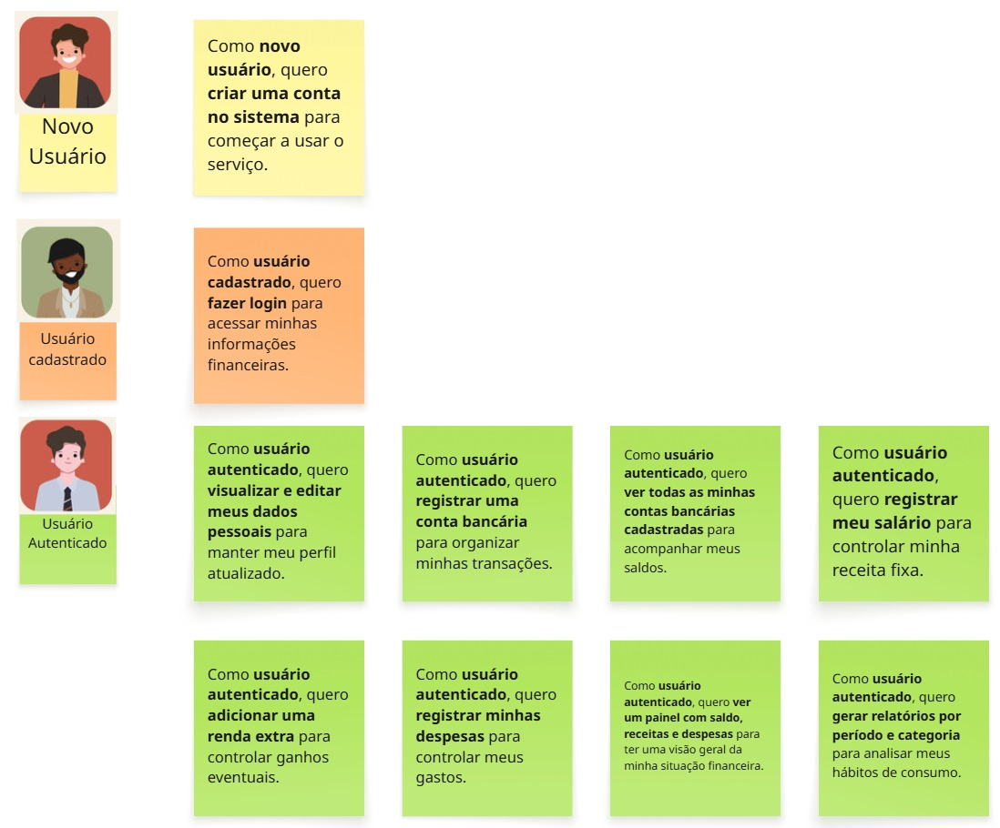

# 📌 Backlog do Sistema de Gestão Financeira EzFin

Este documento apresenta o backlog inicial do projeto, contendo 10 histórias de usuário priorizadas para o desenvolvimento do sistema de gestão financeira.

---

## 🔹 Histórias de Usuário

### 1. Cadastro de Usuário
- **Como** novo usuário  
- **Quero** criar uma conta no sistema  
- **Para** começar a usar o serviço  

---

### 2. Login
- **Como** usuário cadastrado  
- **Quero** fazer login  
- **Para** acessar minhas informações financeiras  

---

### 3. Gerenciar Perfil
- **Como** usuário autenticado  
- **Quero** visualizar e editar meus dados pessoais  
- **Para** manter meu perfil atualizado  

---

### 4. Cadastrar Conta Bancária
- **Como** usuário autenticado  
- **Quero** registrar uma conta bancária  
- **Para** organizar minhas transações  

---

### 5. Consultar Contas Bancárias
- **Como** usuário autenticado  
- **Quero** ver todas as minhas contas bancárias cadastradas  
- **Para** acompanhar meus saldos  

---

### 6. Registrar Salário
- **Como** usuário autenticado  
- **Quero** registrar meu salário  
- **Para** controlar minha receita fixa  

---

### 7. Registrar Renda Extra
- **Como** usuário autenticado  
- **Quero** adicionar uma renda extra  
- **Para** controlar ganhos eventuais  

---

### 8. Registrar Despesa
- **Como** usuário autenticado  
- **Quero** registrar minhas despesas  
- **Para** controlar meus gastos  

---

### 9. Visualizar Resumo Financeiro
- **Como** usuário autenticado  
- **Quero** ver um painel com saldo, receitas e despesas  
- **Para** ter uma visão geral da minha situação financeira  

---

### 10. Fazer transações entre contas
- **Como** usuário autenticado  
- **Quero** fazer transações entre minhas contas  
- **Para** controlar melhor minha situação financeira

---

## 🔹 Ilustração

