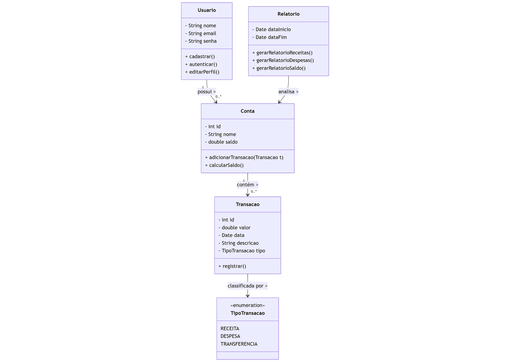

# 📌 Diagrama de Classes – EZFin

O diagrama abaixo representa a estrutura de classes do sistema de **gestão financeira EZFin**, mostrando as principais entidades e seus relacionamentos.

---

## 🧑 Classe `Usuario`
- **Descrição:** Representa um usuário do sistema.  
- **Atributos:** nome, email, senha.  
- **Métodos:**  
  - `cadastrar()` → cria uma nova conta de usuário.  
  - `autenticar()` → permite login no sistema.  
  - `editarPerfil()` → permite alterar informações pessoais.  

---

## 🏦 Classe `Conta`
- **Descrição:** Representa uma conta bancária do usuário.  
- **Atributos:** id, nome da conta, saldo.  
- **Métodos:**  
  - `adicionarTransacao(Transacao t)` → registra uma transação na conta.  
  - `calcularSaldo()` → atualiza o saldo considerando todas as transações.  

---

## 💸 Classe `Transacao`
- **Descrição:** Representa uma movimentação financeira (receita, despesa ou transferência).  
- **Atributos:** id, valor, data, descrição, tipo (TipoTransacao).  
- **Métodos:**  
  - `registrar()` → salva a transação associada à conta.  

---

## 📊 Classe `Relatorio`
- **Descrição:** Permite gerar relatórios financeiros baseados nas contas e transações.  
- **Atributos:** dataInicio, dataFim.  
- **Métodos:**  
  - `gerarRelatorioReceitas()` → gera relatório de receitas.  
  - `gerarRelatorioDespesas()` → gera relatório de despesas.  
  - `gerarRelatorioSaldo()` → gera relatório do saldo final.  

---

## 🏷️ Classe `TipoTransacao`
- **Descrição:** Enumeração que define o tipo de transação.  
- **Valores possíveis:**  
  - `RECEITA` → entrada de dinheiro.  
  - `DESPESA` → saída de dinheiro.  
  - `TRANSFERENCIA` → transferência entre contas.  

---

## 🔗 Relacionamentos principais
- Um **Usuario** pode possuir várias **Contas**.  
- Uma **Conta** contém várias **Transacoes**.  
- Um **Relatorio** analisa uma **Conta**.  
- Uma **Transacao** é classificada por um **TipoTransacao**.  
